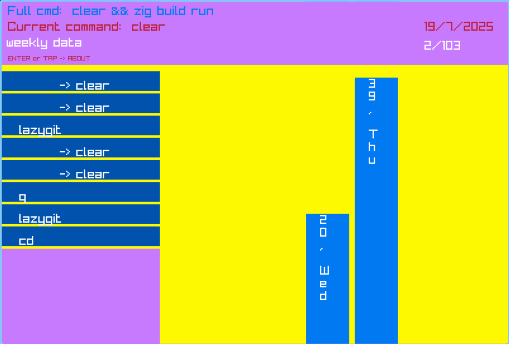
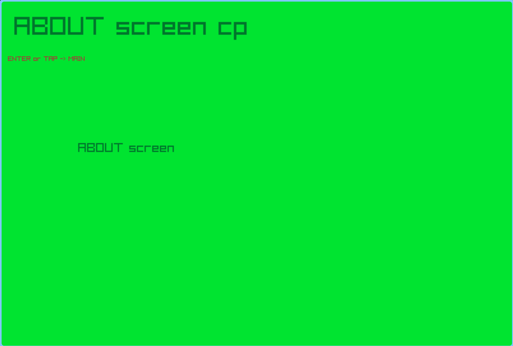

# ZISTORY

Zig terminal history stats viewer with Raylib. Take a look at your commands
frequency on a GUI.

Pretty rough visuals (WIP). But it kinda works.

Made with [Raylib-zig](https://github.com/Not-Nik/raylib-zig) and two (2) custom
widgets designed specifically for the project. Nonetheless, they can be adapted
to suit ones own need.

[Raylib-bar_char](https://github.com/RomaricKc1/raylib-bar_chart) and [Raylib-list](https://github.com/RomaricKc1/raylib-lists)

Tested on Zig version `0.16.0` and `0.17.0-dev.387+31f157d80`.

# Demo

|                      Main screen                      |                      About (empty now)                       |
| :---------------------------------------------------: | :----------------------------------------------------------: |
|  |  |

The `bar graph` widget shows the current command count and the day of the week.
e.g.: the cmd `clear` has been recorded `39x` on `thu`rsday, from today's
date `19/7/2025` (dd/mm/yyyy). This is the `weekly data` view.

The `list` widget shows all the recorded commands with `->` indicating all
instances of the current active one.

## Usage

> [!IMPORTANT]
> The reader looks by default for "`~/.zsh_history_backup`"
> meaning that you have to create a backup of your history file in case anything
> goes wrong. I don't think it will, but better be safe.
>
> You can also pass a file as you wish, using the `-f` option.

> [!NOTE]
> This is configured to work on `wayland`. If you are on `x11`, you'll need to
> change the display `backend`.

In all of the raylib dependency.

```zig
const raylib_dep = b.dependency("raylib_zig", .{
    .target = target,
    .optimize = optimize,
    .linux_display_backend = .X11,
});
```

## Key-bindings

`j` and `k` => to cycle through the list of commands on the list widget.

`h` and `l` => to cycle through the timespan of the data shown. Currently support
is only avail for `week` and `month`.

`a` to exit. Somehow, raylib requires the key `a` on my french keyboard to exit.
There's a flag for a custom key (`-q`).

> [!NOTE]  
> Only support history files with timestamps. Right now it's tailored to `zsh` history.

## Options

```txt
Options:
    -L, --window_width <WIDTH>                        window width (default 800)
    -l, --window_height <HEIGHT>                      window height (default 540)
    -s, --fps <FPS>                                   fps count (default 60)
    -n, --cmd_cnt <CMD_CNT>                           number of entries to read
                                      from the history file (default 103)
    -t, --time <TIME>                                 timestamp from which to
                                      read the entries (default current time)
    -k, --elm_on_list_cnt <LIST_SHOWN_CNT>            the number of the list's
                                      entries to show at once
    -f, --history_file <HIST_FILE>                    your history file. default
                                      for zsh -> "~/.zsh_history", make a backup
                                      ( "~/.zsh_history_backup") for it first
    -q, --exit_key <EXIT_KEY>                         key used to exit. default ('a')
    -v, --version                                     Display version information.
    -h, --help                                        Display this help and exit.
```

## TODO

- [ ] option to target wayland / x11 automatically
- [ ] ui element won't scale up pretty well when changing the default window dimensions
- [ ] add key-binding for `gg` and `GG` to quickly jump to the `beginning` and
      the `end` of the list
- [ ] maybe, add a search support to quicly jump into a desired command data
- [ ] look for integrating other shell history file.

## But why?

It is a toy project on my journey of learning [ZIG](https://ziglang.org).
I learned a lot while making this project.
